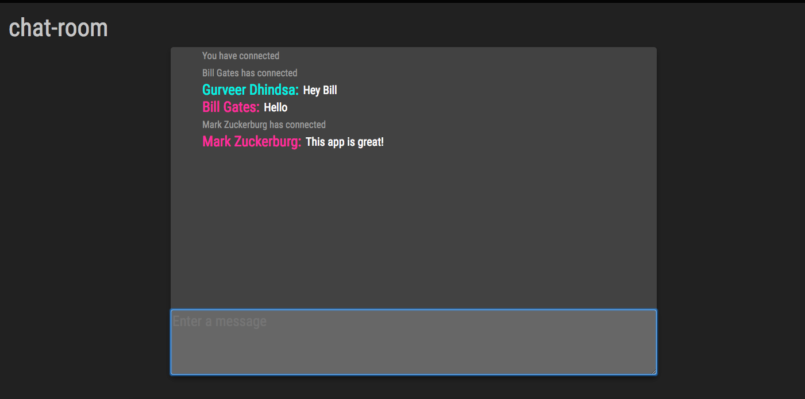
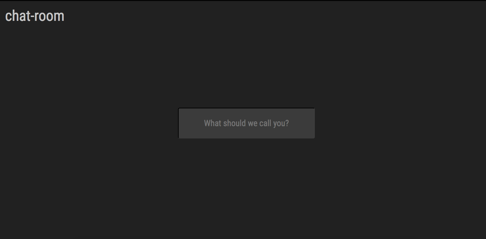

# chat-room

>A chat room

##  Installation
> Install npm packages
```
npm install
```

### Clone
- Clone this repo to your local machine using `https://github.com/gurveerdhindsa/chat-room.git`

### Development
```
npm start
```

##  Tech stack
- Node.js
- Socket.IO
- jQuery
- Less


##  Support
- Website at <a href="https://gurveerdhindsa.github.io/portfolio/" target="_blank">`gurveerdhindsa.github.io`</a>
